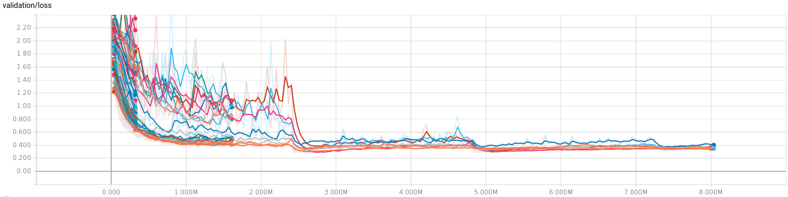

This repository can be explained in two graphs; [hyperband][] runs models
for some epochs then discards half, so optimisation looks like this:



But how do we run all these model configurations? In this repo, we throw
them into pytorch in batches equal to the size of your GPU:


# Fast Simple Hyperparameter Search with PyTorch

The goal is to make a hyperparameter that is robust by being simple and
runs quickly. Typically this is for comparing two different models, where
you need to be sure one is not better just by luck in stochastic
optimisation.

The trick making this optimisation fast is the extremely fast model
construction and loading times in PyTorch. We can tear down and construct
models in a fraction of the time it takes to train an epoch, which would
not be possible in Tensorflow or Theano. So, on every iteration we're
loading a selection of models from disk, training for some epochs and then
saving back to disk.

This implementation hinges on a training script that is *persistent*, ie it
can be stopped and started arbitrarily and it'll keep running. Given
different settings, it'll always check to see whether those settings have
been run before and pick up where it left off if they have. Then, all the
`hyperband.py` script has to do is call this script, which is what it does.

Training in this way is ideally suited to [Hyperband][], but there are
other methods we could also use. The intuition behind this model is that we
are throwing away half of the worst performing models after training them
all for a specified length of time.

[hyperband]: https://people.eecs.berkeley.edu/~kjamieson/hyperband.html

## Checkpoints

The `Checkpoint` object we've defined handles saving, loading, forward and
backward passes through our model. Models are saved using `torch.save` in
dictionaries with the following attributes:

* `'epoch'`: the number of epochs the model has been trained
* `'acc'`: validation accuracy at that epoch
* `'net'`: the network itself (would be better to use the state dict, [this
is an issue][statedict])

The filename of each checkpoint itself contains the hyperparameter settings
and also contains the epoch and accuracy. These are given to an arbitrary
number of significant digits that is kept constant.

# DICE Setup

Export `SCRATCH` as a environment variable before running to choose where
to save data and checkpoints:

```
export SCRATCH=<somewhere on scratch like /disk/scratch/you>
```

## Accuracy

Should note that the accuracies we're comparing against in this table are
for [models trained
on the full training set][kuangliu], whereas we use a validation split for model
comparison. We could overfit to the test dataset and get higher accuracies.

| Model             | Acc.        | Acc. after optimisation |
| ----------------- | ----------- | ----------- |
| [VGG16](https://arxiv.org/abs/1409.1556)             | 92.64%      | ??? |

[kuangliu]: https://github.com/kuangliu/pytorch-cifar
[statedict]: https://github.com/BayesWatch/reliable-train/issues/33
