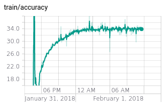
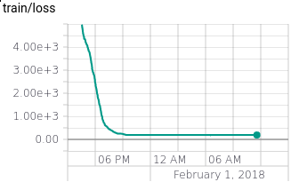
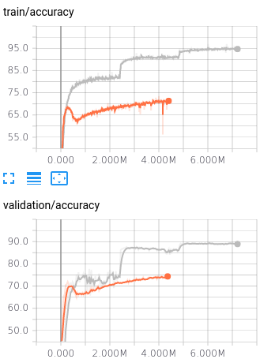
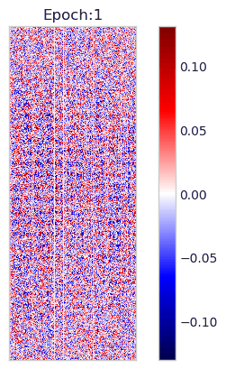
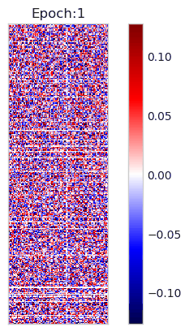

28th November 2017
------------------

Problems with subprocess:

1. When using `process.terminate()` process disappears from list of
processes on GPU, but GPU memory still full. Also, causes the program to
hang waiting at the next `communicate()`

Have also noticed that the `satisficing.py` script is not managing to keep
everything on one GPU. Every process that has stuff on the other GPUs
is *also* allocating memory on GPU 0. I have no idea why this is happening,
because the only times `.cuda` is called, the GPU index is supplied, and
it's global to the script. May be necessary to using
`CUDA_VISIBLE_DEVICES`.

1st December 2017
-----------------

Managed to solve the problem with subprocess by killing the whole process
group. Started using `CUDA_VISIBLE_DEVICES` to solve the second problem,
which should solve it.

11th December 2017
------------------

Debugging the script meant to run experiments on Bayesian Compression. The
script will run, and is running with VGG16. However, initial experiments
with ResNet50 (it was a mistake to run this first) didn't converge. I
suspect this is something to do with the weight of regularisation; the ELBO
is *huge*. Sample input and output during training:

```
> python bayes.py 0.1_0.1_64 --model VGG16 -v
Step: 168ms | Tot: 2m8s | | 0 | 188771.970 | 15.239% | 0.920 | 
```

I know that VGG16 has a lot more parameters in it than the experiments in
the Bayesian Compression Tutorial, but that still seems a little high, and
I can see why it might not converge in these conditions.

To be sure, the best thing for me to do is probably to run the [tutorial
code](https://github.com/BayesWatch/Tutorial_BayesianCompressionForDL) and
see what the losses it reports during training are.

*Done that*: looks like the ELBO does grow with the number of parameters in
your model, as you might expect. But, it's still far lower for their
examples. Also, there is no convolution architecture in the tutorial to get
a better comparison against. Inconclusive.

After training VGG16 to near the end of the first epoch, training produces
NaNs, and these propagate throughout the system.

This doesn't happen if we disable the variational loss, so something's
going wrong.

Easiest way to debug this is going to be to change the model to a simple
MLP and see if this can converge as in the tutorial example; CIFAR-10 is
harder than MNIST, but a simple MLP still shouldn't produce NaNs.

Wrote a simple MLP learning from the channel-wise mean pixels, and
confirmed that without the kl divergence loss it does converge.

After including the kl divergence loss, the elbo is about 200 times larger
than in the tutorial. Suspect my function that is supposed to gather kl
divergences from the layers composing a network is quite broken.

Checked by substituting the example method (built-in method in the Net
class), and got the same error.

Appears that it is probably that I'm using a broken way to get the size of
the training set `len(trainloader)` returns the number of minibatches,
*not* the number of examples. Fixing that fixes my MLP, but may not fix
VGG16. Also, we still have no assurance that we're always going to be able
to avoid NaNs.

After running for 33 epochs (getting to 85% accuracy on validation) the
VGG16 Bayesian Compression model starts to hit NaNs.

Solution to this is probably to use the `clip_variances` function in the
example. So, putting in a function to implement this.

*Sidenote*: the sparsity this method causes isn't obvious from the
perspective of the sparsity measuring function. We kind of have to know
what the sparsity might be, so we need to implement something new to track
sparsity in just these experiments. May be worth using the functions
already developed in the Bayesian Compression Tutorial.

Still hitting NaNs, even with the variance limits, will have to do a more
in-depth search to figure out exactly what's causing them. Probably not
enough time to do that today.

12th December 2017
------------------

Satisficing experiment I was running in `satisficing.py` appears to have
issues. Specifically, the predicted objective and actual objective appear
to be precisely the same value. Making an issue for this.

13th December 2017
------------------

Added code to detect NaNs, so I can at least see at what point they are
occurring. Probably not enough to figure out what's going wrong, but can
open a debugging or pickle the state when it happens to investigate next.

31st January 2018
-----------------

Added gradient clipping to Bayesian compression experiments, which appears
to have solved problems we were seeing with NaNs. Immediately tried to
train a resnet50 with Adam as the optimizer (lr 0.001) and it failed to
converge. Loss is minimized, but in a local optimum where accuracy is very
low (20-30%).





1st February 2018
-----------------

Running a tiny all convolutional network after fixing a probable bug in the
optimizer initialisation implementation. The small network converges a lot
more easily than the deep resnet. Probably it's not having such a large
problem with the ELBO, thanks to having fewer parameters. However,
comparing it to training the same network without bayesian compression, it
looks like it's not overfitting the same way.

The vanilla network is in grey:



With Bayesian compression the network is underfitting, but the validation
and training accuracies are tracking nicely. Without, the network overfits
in the classic way neural networks do.

**Important note**: the learning rate decays in the vanilla training, but
not in the Bayesian compression one. It would be interesting to see if that
would help.

5th February 2018
-----------------

Running the original bayesian compression code to see what the results it
actually generates are, so that we know what we should be getting out of
it. After training for 5 epochs, it says:

```
Compressing the architecture will decrease the model by a factor of 1.3.
Making use of weight uncertainty can reduce the model by a factor of 4.1.
Test error after with reduced bit precision:
Test loss: 0.0800, Accuracy: 9732/10000 (97.32%)
```

It also produces the following images:


|First layer weights |Second Layer weights|
| :------ |:------: |
|||

From the [readme in the original
repo](https://github.com/KarenUllrich/Tutorial_BayesianCompressionForDL) it
seems like we should probably run this for a bit longer. After 100 epochs
the results are clear.

Running for 100 epochs using our layer definitions, but none of the other
changes to the interface I introduced:

|First layer weights |Second Layer weights|
| :------ |:------: |
|||

Forgot to note the final test loss etc this time. Ran again after switching
to use our kl divergence interface. Got the following.

```
Compressing the architecture will decrease the model by a factor of 6.9.
Making use of weight uncertainty can reduce the model by a factor of 27.6.
Test error after with reduced bit precision:
Test loss: 0.0814, Accuracy: 9757/10000 (97.57%)
```

|First layer weights |Second Layer weights|
| :------ |:------: |
|||

After doing all this the only difference between our code and the original
is the use of `clip_var`. It's only used in the first layer in the original
code, but we set it to 0.5 and use it everywhere. Unsure why I set it to
0.5, but it's much higher than the original one.
