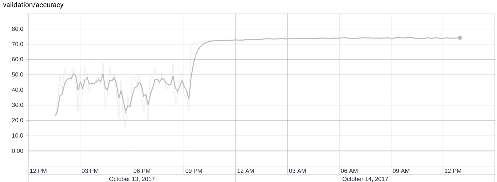
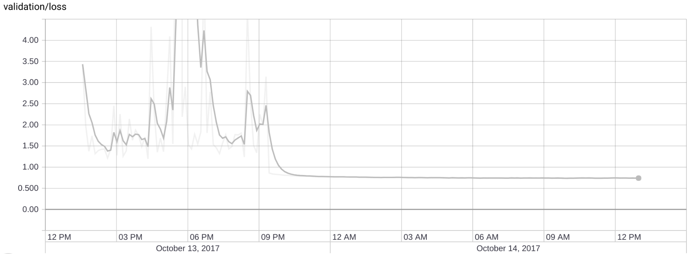
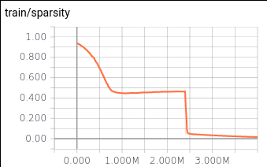
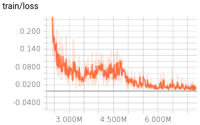
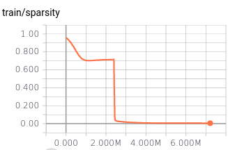
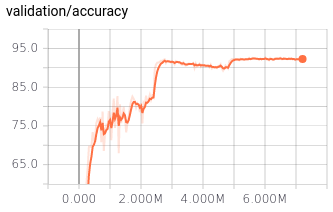
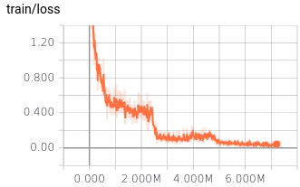
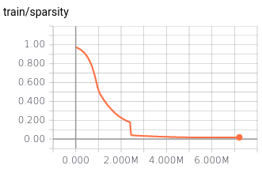
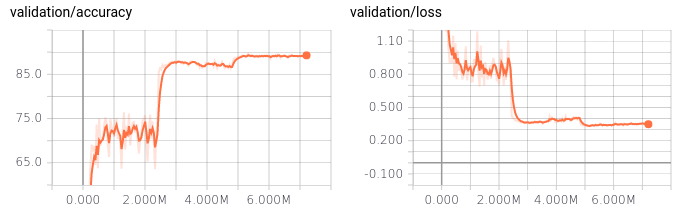
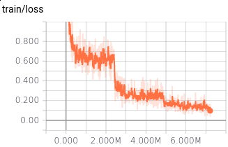

2nd October 2017
----------------

Found that an L1 coefficient of 0.0001 with resnet50 is [probably too
high](https://gist.github.com/gngdb/58ad2b20abdfe6c42fa223004747d28a). So
will be using 0.00005. 

In the process of running the non sparse benchmarks with different sizes.

4th October 2017
----------------

Results benchmarking performance as a function of size (with reduced size
experiments) can be found
[here](https://gist.github.com/gngdb/4d70b62addd4a96885e981e837645353).

Sparse results would be today, but there was a bug in the `hyperband.py`
parsing of the l1 argument, so they were all run with an l1 of zero.
Luckily, that means that `main.py` just went over all the non-sparse
experiments again, filling in any that it had missed.

5th October 2017
----------------

Sparse results are _still_ pending. Was running a VGG16 experiment on
another machine and AFS synced the changes when I started the experiment
running sparsity, so ended up running VGG16 when I meant to run an
experiment with resnet50. Will have to be tomorrow.

6th October 2017
----------------

Sparse results published to the same notebook as before
[here](https://gist.github.com/gngdb/4d70b62addd4a96885e981e837645353). On
the validation got the nice result that the sparse network exceeds the
performance of the full network for a given number of active parameters,
but on the test set this didn't hold. Could be that L1 causes overfitting,
or could just be noise, as the accuracy difference is only around 1%.

12th October 2017
-----------------

Planning experiments involving other algorithms for sparsification.
Sticking with the same resnet50 architecture, we would like to see if the
[Deep Compression][dc] pruning algorithm can be applied to sparsify it
better than using L1 regularisation.

Unfortunately, they have never published much in the way of useable code,
so we have to guess based on the [both][dc] [papers][lw]. It looks like, in the simplest
reading the algorithm is the following:

1. Train with L2 regularisation (and dropout if you expect to have problems
with overfitting).
2. After this network has converged quite well, remove all parameters with
an absolute value below a threshold (unfortunately, we don't know what to
set this threshold to).
3. Retrain with a smaller learning rate.

Going to follow the lead of [this paper][d2017] when replicating deep
compression and prune until a set number of parameters remain. Will
experiment to see what a reasonable proportion of parameters to throw away
is. Will do the pruning when we've been reducing the learning rate, to
maintain consistency with the optimisation routine. Will have to develop
code to fix parameters to zero.

The other paper which we are going to replicate is [Sparsifying Variational
Dropout][spvar], because it get's very competitive sparsification results
and I've already replicated it twice.

[dc]: https://arxiv.org/abs/1510.00149v5
[lw]: https://arxiv.org/abs/1506.02626
[spvar]: https://arxiv.org/abs/1701.05369
[d2017]: https://arxiv.org/abs/1705.07565

13th October 2017
-----------------

Intended to start the experiments with variational dropout today, but
couldn't replicate the variational dropout results in pytorch on MNIST.
Unsure exactly why at this point, but the optimisation is just falling into
the local optimum of zeroing all the weights every time.

I don't really know why this doesn't happen in the Tensorflow version of
the code, but the fact is that it doesn't. Comparing the code for each
version against each other to try and find a problem. If that doesn't work,
only idea I have left is numerical gradient checking on pytorch to check
that something isn't getting dropped and ruining the optimisation.

16th October 2017
-----------------

Ran experiment with experimental butterfly architecture over the weekend,
training a simple resnet18. Unfortunately, could only get it to converge to
74%. Training was unstable:

Unsure why it should be so unstable, but would hope that if it could be
trained it should be able to represent any function that can be represented
by a single fully connected 1x1 convolution.

Also, realised that a good implementation of variational dropout in pytorch
is extremely difficult, because it requires running *two* convolutions in
parallel for every convolution you would do in a vanilla network. So, it
may not even be worth porting it from tensorflow. It may be easier to just
write a new training script in tensorflow.

24th October 2017
-----------------

Deep compression experiments with resnet50 seem to suggest that it's *very*
difficult to retrain after sparsification. 10 epochs in, there is almost no
progress back to the accuracy the network was getting before
sparsification. The paper suggests that it may be better to sparsify more
slowly, training in between, but I haven't tried that yet. Running for
longer to make sure.

6th November 2017
-----------------

Tested the deep compression after fixing an embarrassing bug (not taking
the absolute value before less than). Was able to get reasonable results
across a range of l2 values:

* L2 5e-3: 0.051% active parameters, 72.82% validation accuracy
* L2 1e-3: 1.0% active parameters, 91.5% validation accuracy
* L2 5e-4: 2.4% active parameters, 92.4% validation accuracy
* L2 5e-5: 10.45% active parameters, 92.5% validation accuracy

Interesting to note that immediately after setting all values less than
0.02 to zero there is a short period where sparsifification increases. Some
more parameters have to go to zero for the network to reconfigure itself
to get its recent performance back.

5th December 2017
-----------------

Running deep compression with default settings for each of the three
architectures I've decided on to check for sanity. Running the following:

* `python main.py 0.1_0.1_128 --model resnet50 -v --gpu 2 --deep_compression`
* `python main.py 0.1_0.1_128 --model VGG16 -v --gpu 1 --deep_compression`
* `python main.py 0.1_0.1_128 --model mobilenet -v --gpu 1  --deep_compression`

6th December 2017
-----------------

With the default settings described yesterday, ended up with the following
results training with deep compression using the standard threshold of
0.02.

### VGG16

The final sparsity value recorded was 0.016 (1.6% of parameters active). We
can clearly see the thresholding operation happening in the sparsity trace:

At the same time, the final validation accuracy was 91.8%:

In the final iterations, despite the pruning, the loss was still able to
go close to zero:

### ResNet50

The final sparsity in this model is ridiculous, finishing up at 5e-3:

But, we are taking an accuracy hit here. Before sparsifying, this model was
able to get a validation accuracy of 93.6%. Now it finishes at 92.3%:

Maybe due to the high sparsity, the final training loss doesn't get quite
as close to zero:

### MobileNet

This model should tolerate less sparsity, as the architecture is already
tuned to reduce parameter usage (VGG16 is certainly not). I don't know what
the baseline is for this model on CIFAR-10, so pending a run without deep
compression for comparison (running now, the above command without
`---deep_compression`).

However, the model actually sparsifies quite heavily only under weight
decay, and the final sparsity is competitive with VGG16, at 0.017:

The final accuracy is much worse than the other two models, at 89%. It
looks like it doesn't really converge:

On the training set it isn't able to get anywhere near zero:

Still, impressive that it's able to operate with so few active parameters.
